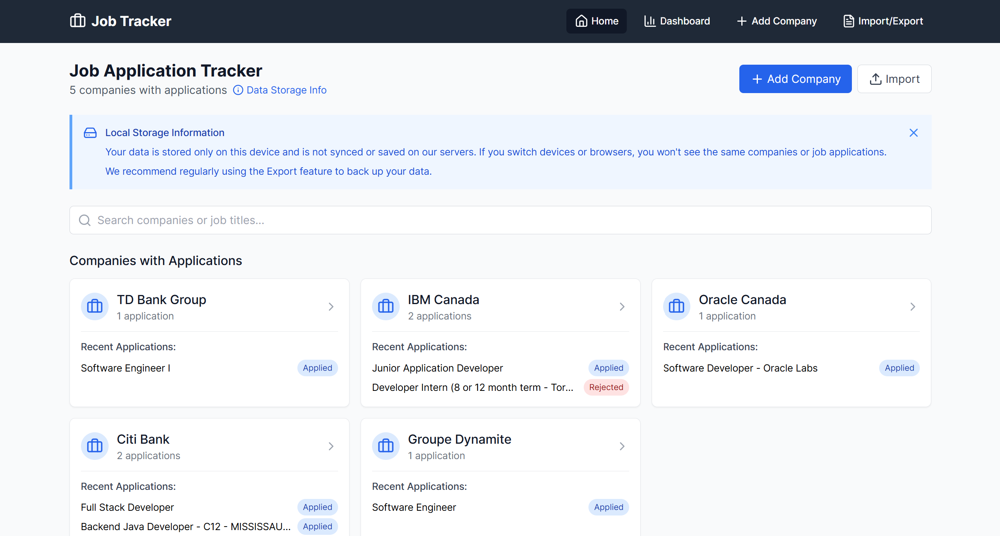

# Job Tracker: Application Management System



**Job Tracker** is a comprehensive application management system built with React and modern web technologies. It helps job seekers track their applications, manage follow-ups, and analyze their job search progress through an intuitive dashboard.

## 🌟 Features

- **Company Management**: Add, edit, and track companies you've applied to
- **Application Tracking**: Monitor the status of each job application (Applied, Interview, Offer, Rejected)
- **Follow-up Reminders**: Set and manage follow-up dates to never miss an opportunity
- **Interview Notes**: Document preparation materials, questions, and feedback for each interview
- **Analytics Dashboard**: Visualize your job search progress with charts and statistics
- **Skills Tracking**: Highlight and track which skills you've emphasized in applications
- **Import/Export**: Backup and transfer your data with CSV import/export functionality
- **Local Storage**: All data is stored on your device for complete privacy

## 🚀 Live Demo

Try it out: [Job Tracker Live Demo](https://job-tracker.rohitrana.dev)

## 💻 Technologies Used

- **React** - Frontend framework
- **React Router** - Navigation and routing
- **Tailwind CSS** - Styling and responsive design
- **Recharts** - Interactive charts and data visualization
- **Lucide Icons** - Modern icon set
- **LocalStorage API** - Client-side data persistence
- **PapaParse** - CSV parsing and generation
- **UUID** - Unique ID generation

## 📋 Prerequisites

- Node.js 16.x or higher
- npm 8.x or higher

## 🔧 Installation

1. Clone the repository

   ```bash
   git clone https://github.com/rohitrana043/job-tracker.git
   cd job-tracker
   ```

2. Install dependencies

   ```bash
   npm install
   ```

3. Start the development server

   ```bash
   npm run dev
   ```

4. Open your browser and navigate to `http://localhost:5173`

## 🏗️ Building for Production

```bash
npm run build
```

The build artifacts will be stored in the `dist/` directory, ready to be deployed to any static hosting service like Netlify, Vercel, or GitHub Pages.

## 📱 Mobile Responsiveness

Job Tracker is designed to work seamlessly across all device sizes:

- Responsive navigation with a collapsible menu on mobile
- Optimized forms and layouts for touch interfaces
- Proper spacing and font sizes on small screens

## 🛠️ Project Structure

```
job-tracker/
├── public/              # Static assets
├── src/
│   ├── components/      # Reusable UI components
│   ├── pages/           # Page components
│   ├── utils/           # Utility functions and helpers
│   ├── App.jsx          # Main application component
│   └── main.jsx         # Application entry point
├── index.html           # HTML template
└── package.json         # Dependencies and scripts
```

## 💡 Usage Guide

### Adding Companies

1. Click the "Add Company" button
2. Enter company details
3. Save the company to your tracker

### Tracking Applications

1. Navigate to a company detail page
2. Click "Add Job" to create a new application
3. Fill in job details including title, status, and application date
4. Set a follow-up reminder date if desired

### Managing Interview Notes

1. On a company detail page, switch to the "Interview Notes" tab
2. Add notes for preparation, interview questions, or feedback
3. Organize notes by category for better reference

### Using the Dashboard

1. Navigate to the "Dashboard" to view your application analytics
2. Track your application progress, response rate, and activity over time
3. Monitor upcoming follow-ups to stay on top of your job search

### Importing/Exporting Data

1. Use the Import/Export page to back up your data
2. Export your data before switching devices
3. Import previously exported data to restore your information

## 🤝 Contributing

Contributions are welcome! Please feel free to submit a Pull Request.

1. Fork the project
2. Create your feature branch (`git checkout -b feature/amazing-feature`)
3. Commit your changes (`git commit -m 'Add some amazing feature'`)
4. Push to the branch (`git push origin feature/amazing-feature`)
5. Open a Pull Request

## 📄 License

This project is licensed under the MIT License - see the [LICENSE](LICENSE) file for details.

## 📬 Contact

Rohit Rana - [rohit.rana043@gmail.com](mailto:rohit.rana043@gmail.com)

Project Link: [https://github.com/rohitrana043/job-tracker](https://github.com/rohitrana043/job-tracker)

---

Made with ❤️ by Rohit Rana
